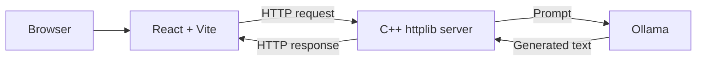

# LadyBug 🐞

LadyBug is a self-hosted AI interface that connects a React frontend to a local Ollama model through a lightweight C++ server, with future support planned for Raspberry Pi hosting.

> [!IMPORTANT]
> LadyBug is an early-stage open-source project that is still being prepared for broader use and contribution. For now, email [eurisotodev@gmail.com](mailto:eurisotodev@gmail.com) with questions about contributing, bug reports, pull requests, or feature requests.

## About 🔖

LadyBug explores a simple, decoupled approach to running a locally hosted AI assistant:

- A React interface accepts prompts and displays model responses.
- A lightweight C++ server handles requests between the browser and the model.
- Ollama runs the language model locally.

The long-term goal is to develop LadyBug into a modular, self-hosted AI platform that can run on personal hardware such as a Raspberry Pi-based home server. The project currently focuses on establishing a small, understandable MVP before introducing persistence, model management, plugins, or cloud hosting.

The repository is currently named `LLAMA_BMCC`, but the project and interface are transitioning to the name **LadyBug**.

## Project Status 

LadyBug is currently a working demo under active development. The present MVP is intentionally narrow: submit a prompt through the web interface, send it through the C++ server to a local Ollama model, and display the model's response.

Documentation, contribution processes, testing, and project organization are still in development. APIs and internal structure may change while the project is in this early stage.

## Current Features

- Locally hosted language-model inference through Ollama
- React-based prompt and response interface
- Lightweight C++ middleware built with `cpp-httplib`
- Configurable Ollama model and generation parameters in the config files for now (but will be available directly through the UI Frontend)
- Production build served directly by the C++ server

## How It Works



A more detailed architecture and codebase map are coming soon.

## Getting Started

LadyBug currently targets macOS and Linux.

### Prerequisites

Install the following before continuing:
- [Node.js and npm](https://nodejs.org/)
- A C++ compiler with C++17 support (g++ / clang)
- `make`
- [Ollama](https://ollama.com/)

Make sure Ollama is installed and running before starting LadyBug.

### 1. Clone the repository

```bash
git clone https://github.com/noob339/LLAMA_BMCC.git
cd LLAMA_BMCC
```

### 2. Download the model

The current configuration uses Qwen 3 4B:

```bash
ollama pull qwen3:4b
```

Confirm that the `FROM` line in `test.conf` matches the downloaded model:

```text
FROM qwen3:4b
```

### 3. Install and build the frontend

```bash
cd client
npm install
npm run build
```

Vite places the production frontend in `client/dist`. The C++ server serves this directory when the application starts.

### 4. Build and run the server

From the `server` directory:

```bash
cd ../server
make
./main
```

The server will create the configured Ollama model, warm it up, and listen on port `8080`.

### 5. Open LadyBug

Visit:

```text
http://localhost:8080
```
The port can be changed in the main.cpp files

Enter a prompt and submit it. The browser sends the request to the C++ server, which runs the local model and returns its response.

## Frontend Development

To use Vite's development server and hot reloading, keep the C++ server running and start Vite from another terminal:

```bash
cd client
npm run dev
```

Open the local URL printed by Vite, usually `http://localhost:5173`. During development, Vite proxies API requests such as `/query` to the C++ server at `http://localhost:8080`.

Changes to frontend source files must be rebuilt with `npm run build` before they appear in the version served at `http://localhost:8080`.

## Technology

| Area | Technology |
| --- | --- |
| Frontend | React, Vite |
| Language | JavaScript |
| Styling | CSS Modules |
| Server | C++ cpp-httplib|
| Model runtime | Ollama |

PostgreSQL or another database may be added later for threads, history, projects, and other persistent data.

## Development Roadmap

LadyBug is currently in its early setup stage. You can view the
temporary [development board](https://docs.google.com/spreadsheets/d/1DVUpXzJTxE8OKFFyNbWwE7Y2Eh3aTayy_FgmFKcwKVo/edit?usp=sharing) to see current progress.

The board is read-only and will eventually be replaced by GitHub Projects.

Planned areas of development include:

- Persistent conversations and chat history
- Establish an issue and pull-request workflow
- Conversation branching and tree-based navigation
- Projects and nested folders for organizing conversations 
- Model selection and parameter controls
- A database schema and persistence layer
- Automated tests and GitHub Actions
- Raspberry Pi and home-server deployment
- Modular pluggable features
- Contributor roles and a path toward project membership
- A hosted project website with a clearly defined privacy and data-retention policy
- Document the codebase structure and API routes

These ideas describe the direction of the project and should not be treated as currently available features.

## Contributing

Contributions will be welcomed as LadyBug develops. A nascent [contribution guide](CONTRIBUTING.md) is currently up at.

Until that guide and the repository's issue workflow are ready, email [eurisotodev@gmail.com](mailto:eurisotodev@gmail.com) with any questions, issues and concerns. 

## Credits

- **Noob339** — Creator and maintainer
- **Open Source Software Development at Columbia University** — Course environment in which the project began

## License

LadyBug is open-source software distributed under the GNU General Public License. See the repository's `LICENSE` file for the exact version and terms.

## Contact

Questions, ideas, and early contribution inquiries can be sent to [eurisotodev@gmail.com](mailto:eurisotodev@gmail.com).
